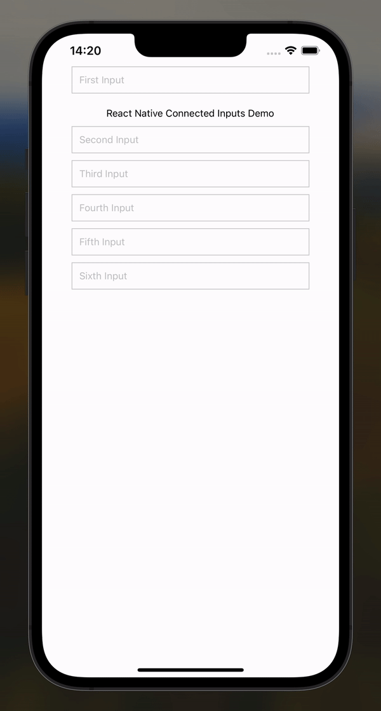

# react-native-connected-inputs

<div>
  
</div>

```@gfean/react-native-connected-input``` lets you connect your text inputs with each other in the react-native app.
The package contains a react native custom hook and a HOC to manage smooth navigation thorugh inputs and submission handling.
This package is pure and has no peer dependencies, making it lightweight and easy to integrate into any React Native project. 
It uses base React Native components and is compatible with any kind of ```TextInput``` which accepts refs.

## Features

* Auto Navigation: Automatically navigates to the next input upon submission.
* Flexible Submission Handling: Execute custom logic when the last input is submitted.
* Pure Package: No additional peer dependencies.
* Lightweight: Minimal impact on your bundle size.
* Base Components: Utilizes base React Native components.
* Compatibility: Works with any type of input component.


## Installation

Install the package using npm or yarn:

```bash
npm install react-native-connected-inputs
```
or
```bash
yarn add react-native-connected-inputs
```

## Usage

### Hook: useConnectedInputs:
The ```useConnectedInputs``` hook allows you to connect multiple inputs, automatically managing focus (as well as the focus order) and submission.

```jsx
import React from 'react';
import { SafeAreaView, TextInput, StyleSheet, Alert } from 'react-native';
import { useConnectedInputs } from 'react-native-connected-inputs';

const App: React.FC = () => {
  const handleFormSubmit = () => {
    Alert.alert('Form Submitted');
  };

  const connectInput = useConnectedInputs(handleFormSubmit);

  return (
    <SafeAreaView style={styles.container}>
      <TextInput style={styles.input} placeholder="First Input" {...connectInput(0)} />
      <TextInput style={styles.input} placeholder="Second Input" {...connectInput(1)} />
      <TextInput style={styles.input} placeholder="Third Input" {...connectInput(2)} />
      <TextInput style={styles.input} placeholder="Fourth Input" {...connectInput(3)} />
    </SafeAreaView>
  );
};

const styles = StyleSheet.create({
  container: {
    flex: 1,
    justifyContent: 'center',
    alignItems: 'center',
  },
  input: {
    borderWidth: 1,
    borderColor: '#ccc',
    padding: 10,
    marginBottom: 10,
    width: '80%',
  },
});

export default App;

```
### HOC: ConnectedInputs
```jsx
import React from 'react';
import { SafeAreaView, TextInput, StyleSheet, Alert, Text } from 'react-native';
import { ConnectedInputs } from 'react-native-connected-inputs';

const App: React.FC = () => {
  const handleFormSubmit = () => {
    Alert.alert('Form Submitted');
  };

  return (
    <SafeAreaView style={styles.container}>
      <ConnectedInputs onSubmit={handleFormSubmit}>
        <TextInput style={styles.input} placeholder="First Input" />
        <Text>Hi there</Text>
        <TextInput style={styles.input} placeholder="Second Input" />
        <TextInput style={styles.input} placeholder="Third Input" />
        <TextInput style={styles.input} placeholder="Fourth Input" />
      </ConnectedInputs>
    </SafeAreaView>
  );
};

const styles = StyleSheet.create({
  container: {
    flex: 1,
    alignItems: 'center',
  },
  input: {
    borderWidth: 1,
    borderColor: '#ccc',
    padding: 10,
    marginBottom: 10,
    width: '80%',
  },
});

export default App;

```

### useConnectedInputsContext
Similarly to ```useConnectedInputs``` hook and ```ConnectedInputs``` HOC,  ```useConnectedInputsContext``` hook provides a way to manage multiple TextInput components in a React Native application, ensuring seamless navigation and submission handling. **It is designed to manage the connection of TextInput components across different parts of your component tree**, ensuring that focus navigation and submission logic work seamlessly regardless of where the inputs are located.

### Example usage
 RegistrationScreen Component:
```jsx
import React from 'react';
import { SafeAreaView, StyleSheet } from 'react-native';

import RegistrationForm from './RegistrationForm';
import { ConnectedInputsProvider } from 'react-native-connected-inputs';


const RegistrationScreen: React.FC = () => {
  return (
    <ConnectedInputsProvider>
      <SafeAreaView style={styles.container}>
        <RegistrationForm />
      </SafeAreaView>
    </ConnectedInputsProvider>
  );
};

const styles = StyleSheet.create({
  container: {
    flex: 1,
    justifyContent: 'center',
    alignItems: 'center',
    padding: 16,
  },
});

export default RegistrationScreen;


```

 RegistrationForm Component:
```jsx
import React, { useEffect } from 'react';
import { View, StyleSheet, Button, Alert } from 'react-native';
import PersonalDetails from './PersonalDetails';
import AccountDetails from './AccountDetails';
import { useConnectedInputsContext } from 'react-native-connected-inputs';


const RegistrationForm: React.FC = () => {
  const { handleSubmit } = useConnectedInputsContext();

  const onSubmit = () => {
    Alert.alert('Registration Submitted');
  };

  useEffect(() => {
    handleSubmit(onSubmit);
  }, [handleSubmit]);

  return (
    <View style={styles.container}>
      <PersonalDetails />
      <AccountDetails />
      <Button title="Submit" onPress={onSubmit} />
    </View>
  );
};

const styles = StyleSheet.create({
  container: {
    width: '100%',
    padding: 16,
  },
});


export default RegistrationForm;

```

PersonalDetails Component

```jsx
import React from 'react';
import { View, StyleSheet, TextInput } from 'react-native';
import { useConnectedInputsContext } from 'react-native-connected-inputs';


const PersonalDetails: React.FC = () => {
  const {connectInput} = useConnectedInputsContext();

  return (
    <View style={styles.container}>
      <TextInput style={styles.input} placeholder="First Name" {...connectInput(0)} />
      <TextInput style={styles.input} placeholder="Last Name" {...connectInput(1)} />
    </View>
  );
};

const styles = StyleSheet.create({
  container: {
    marginBottom: 16,
  },
  input: {
    borderWidth: 1,
    borderColor: '#ccc',
    padding: 10,
    marginBottom: 10,
    width: '100%',
  },
});

export default PersonalDetails;

```
AccountDetails Component
```jsx
import React from 'react';
import { View, StyleSheet, TextInput } from 'react-native';
import { useConnectedInputsContext } from 'react-native-connected-inputs';


const AccountDetails: React.FC = () => {
  const {connectInput} = useConnectedInputsContext();

  return (
    <View style={styles.container}>
      <TextInput style={styles.input} placeholder="Email" {...connectInput(2)} />
      <TextInput style={styles.input} placeholder="Password" {...connectInput(3)} secureTextEntry />
    </View>
  );
};

const styles = StyleSheet.create({
  container: {
    marginBottom: 16,
  },
  input: {
    borderWidth: 1,
    borderColor: '#ccc',
    padding: 10,
    marginBottom: 10,
    width: '100%',
  },
});

export default AccountDetails;

```
Example usage above shows how you can use ```useConnectedInputsContext``` to manage inputs navigation across different parts of your component tree.
Keep in mind, that this needs ```ConnectedInputsProvider``` to work. **Do not** wrap your whole application inside this provider to avoid the unexpected behaviour, use it as a wrapper to the specific form component or screen.

## API

## useConnectedInputs(onSubmit?: () => void)
A hook to manage connected inputs.

#### Parameters
```onSubmit``` (optional): A callback function to be called when the last input is submitted.
#### Returns
A function to connect an input, which takes the order of the input as an argument and returns props to be spread onto the input.

## ConnectedInputs
A higher-order component to manage connected inputs.
#### Props
* ```children```: The input components to be connected.
* ```onSubmit``` (optional): A callback function to be called when the last input is submitted.

You can wrap this around other elements than TextInputs as well, as given in the example above - this will type check for TextInput component and won't create additional refs for any other type of components.


## ConnectedInputsProvider
A context provider component to manage the state and logic for connected inputs across multiple components.

## useConnectedInputsContext()
A hook to access the connected inputs context. This hook provides methods for registering inputs, connecting inputs, and handling form submission. It must be used within a ```ConnectedInputsProvider```.

#### Returns 
* ```registerInput```: A function to register an input.
* ```connectInput```: A function to connect an input, which takes the order of the input as an argument and returns props to be spread onto the input.
* ```handleSubmit```: A function to set the submission handler for the form.


## Note
This package will only help you to connect TextInputs, manage navigation and submission handling as well as the ```returnKeyType```. This is not responsible for keyboard avoiding views, but it works well with different community packages which manage keyboards. 

## Contributing
Contributions are welcome! If you find any issues or would like to suggest improvements, please create a new issue or submit a pull request.

## License
This project is licensed under the [ISC License](https://opensource.org/licenses/ISC).

## Dependencies
No dependencies.