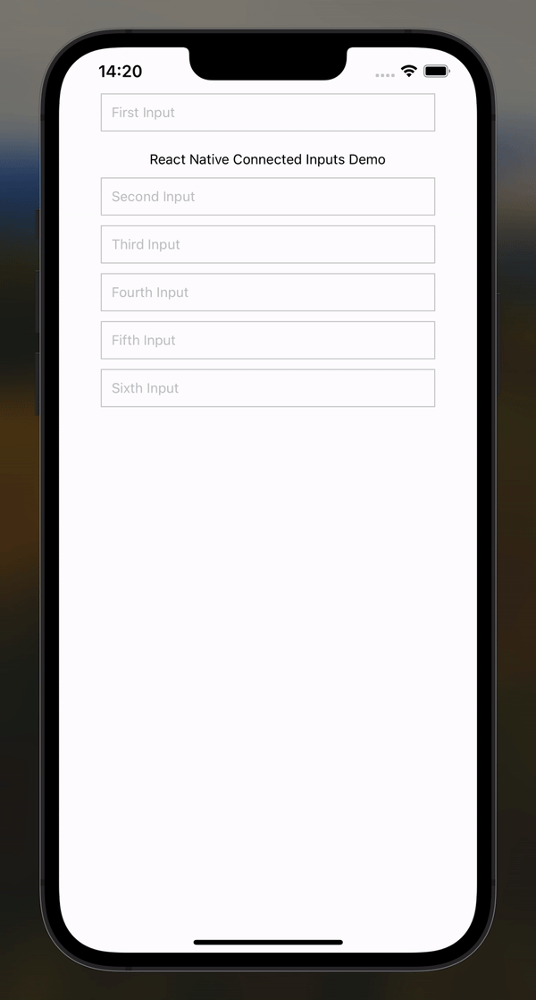

# react-native-connected-inputs

<div>
  
</div>

`react-native-connected-inputs` lets you connect your text inputs with each other in a React Native app.
The package contains a React Native custom hook, a wrapper component, and a context API to manage smooth navigation through inputs and submission handling.
The package has no runtime dependencies beyond its React and React Native peer dependencies, making it lightweight and easy to integrate into existing forms.
The hook and context helpers work with any ref-forwarding input that exposes `focus()` and accepts the standard `onSubmitEditing`, `returnKeyType`, and `blurOnSubmit` props.

## Features

* Auto Navigation: Automatically navigates to the next input upon submission.
* Flexible Submission Handling: Execute custom logic when the last input is submitted.
* Pure Package: No additional runtime dependencies beyond React and React Native.
* Lightweight: Minimal impact on your bundle size.
* Base Components: Utilizes base React Native components.
* Compatibility: Hook/context APIs work with native `TextInput`s and ref-forwarding third-party inputs. `ConnectedInputs` auto-detects native `TextInput`s and can support custom inputs via `isInput`.


## Installation

Install the package using npm or yarn:

```bash
npm install react-native-connected-inputs
```
or
```bash
yarn add react-native-connected-inputs
```

## Usage

### Hook: useConnectedInputs:
The ```useConnectedInputs``` hook allows you to connect multiple inputs, automatically managing focus (as well as the focus order) and submission.

```jsx
import React from 'react';
import { SafeAreaView, TextInput, StyleSheet, Alert } from 'react-native';
import { useConnectedInputs } from 'react-native-connected-inputs';

const App: React.FC = () => {
  const handleFormSubmit = () => {
    Alert.alert('Form Submitted');
  };

  const connectInput = useConnectedInputs(handleFormSubmit);

  return (
    <SafeAreaView style={styles.container}>
      <TextInput style={styles.input} placeholder="First Input" {...connectInput(0)} />
      <TextInput style={styles.input} placeholder="Second Input" {...connectInput(1)} />
      <TextInput style={styles.input} placeholder="Third Input" {...connectInput(2)} />
      <TextInput style={styles.input} placeholder="Fourth Input" {...connectInput(3)} />
    </SafeAreaView>
  );
};

const styles = StyleSheet.create({
  container: {
    flex: 1,
    justifyContent: 'center',
    alignItems: 'center',
  },
  input: {
    borderWidth: 1,
    borderColor: '#ccc',
    padding: 10,
    marginBottom: 10,
    width: '80%',
  },
});

export default App;

```
### Wrapper: ConnectedInputs
```jsx
import React from 'react';
import { SafeAreaView, TextInput, StyleSheet, Alert, Text } from 'react-native';
import { ConnectedInputs } from 'react-native-connected-inputs';

const App: React.FC = () => {
  const handleFormSubmit = () => {
    Alert.alert('Form Submitted');
  };

  return (
    <SafeAreaView style={styles.container}>
      <ConnectedInputs onSubmit={handleFormSubmit}>
        <TextInput style={styles.input} placeholder="First Input" />
        <Text>Hi there</Text>
        <TextInput style={styles.input} placeholder="Second Input" />
        <TextInput style={styles.input} placeholder="Third Input" />
        <TextInput style={styles.input} placeholder="Fourth Input" />
      </ConnectedInputs>
    </SafeAreaView>
  );
};

const styles = StyleSheet.create({
  container: {
    flex: 1,
    alignItems: 'center',
  },
  input: {
    borderWidth: 1,
    borderColor: '#ccc',
    padding: 10,
    marginBottom: 10,
    width: '80%',
  },
});

export default App;

```

`ConnectedInputs` walks nested children and only decorates inputs that match the predicate. If you use a custom input component, pass the optional `isInput` prop so the wrapper knows which elements should participate in focus navigation.

```jsx
<ConnectedInputs
  onSubmit={handleFormSubmit}
  isInput={(child) => child.type === MyTextInput}
>
  <MyTextInput placeholder="First Input" />
  <MyTextInput placeholder="Second Input" />
</ConnectedInputs>
```

`MyTextInput` should forward a ref whose instance exposes `focus()`.

### useConnectedInputsContext
Similarly to ```useConnectedInputs``` and ```ConnectedInputs```, ```useConnectedInputsContext``` provides a way to manage multiple inputs across different parts of your component tree, ensuring seamless navigation and submission handling even when the fields do not live in one component.

### Example usage
 RegistrationScreen Component:
```jsx
import React from 'react';
import { SafeAreaView, StyleSheet } from 'react-native';

import RegistrationForm from './RegistrationForm';
import { ConnectedInputsProvider } from 'react-native-connected-inputs';


const RegistrationScreen: React.FC = () => {
  return (
    <ConnectedInputsProvider>
      <SafeAreaView style={styles.container}>
        <RegistrationForm />
      </SafeAreaView>
    </ConnectedInputsProvider>
  );
};

const styles = StyleSheet.create({
  container: {
    flex: 1,
    justifyContent: 'center',
    alignItems: 'center',
    padding: 16,
  },
});

export default RegistrationScreen;


```

 RegistrationForm Component:
```jsx
import React, { useEffect } from 'react';
import { View, StyleSheet, Button, Alert } from 'react-native';
import PersonalDetails from './PersonalDetails';
import AccountDetails from './AccountDetails';
import { useConnectedInputsContext } from 'react-native-connected-inputs';


const RegistrationForm: React.FC = () => {
  const { handleSubmit } = useConnectedInputsContext();

  const onSubmit = () => {
    Alert.alert('Registration Submitted');
  };

  useEffect(() => {
    handleSubmit(onSubmit);
  }, [handleSubmit]);

  return (
    <View style={styles.container}>
      <PersonalDetails />
      <AccountDetails />
      <Button title="Submit" onPress={onSubmit} />
    </View>
  );
};

const styles = StyleSheet.create({
  container: {
    width: '100%',
    padding: 16,
  },
});


export default RegistrationForm;

```

PersonalDetails Component

```jsx
import React from 'react';
import { View, StyleSheet, TextInput } from 'react-native';
import { useConnectedInputsContext } from 'react-native-connected-inputs';


const PersonalDetails: React.FC = () => {
  const {connectInput} = useConnectedInputsContext();

  return (
    <View style={styles.container}>
      <TextInput style={styles.input} placeholder="First Name" {...connectInput(0)} />
      <TextInput style={styles.input} placeholder="Last Name" {...connectInput(1)} />
    </View>
  );
};

const styles = StyleSheet.create({
  container: {
    marginBottom: 16,
  },
  input: {
    borderWidth: 1,
    borderColor: '#ccc',
    padding: 10,
    marginBottom: 10,
    width: '100%',
  },
});

export default PersonalDetails;

```
AccountDetails Component
```jsx
import React from 'react';
import { View, StyleSheet, TextInput } from 'react-native';
import { useConnectedInputsContext } from 'react-native-connected-inputs';


const AccountDetails: React.FC = () => {
  const {connectInput} = useConnectedInputsContext();

  return (
    <View style={styles.container}>
      <TextInput style={styles.input} placeholder="Email" {...connectInput(2)} />
      <TextInput style={styles.input} placeholder="Password" {...connectInput(3)} secureTextEntry />
    </View>
  );
};

const styles = StyleSheet.create({
  container: {
    marginBottom: 16,
  },
  input: {
    borderWidth: 1,
    borderColor: '#ccc',
    padding: 10,
    marginBottom: 10,
    width: '100%',
  },
});

export default AccountDetails;

```
Example usage above shows how you can use ```useConnectedInputsContext``` to manage inputs navigation across different parts of your component tree.
Keep in mind that this needs ```ConnectedInputsProvider``` to work. Prefer scoping the provider to the specific form or screen that needs shared input navigation rather than wrapping your whole application.

## API

## useConnectedInputs(onSubmit?: () => void)
A hook to manage connected inputs.

#### Parameters
```onSubmit``` (optional): A callback function to be called when the last input is submitted.
#### Returns
A function to connect an input, which takes the order of the input as an argument and returns props to be spread onto the input.

`connectInput(order, options?)`

* `order`: Numeric input order. Orders do not need to be contiguous; sparse and 1-based orders are supported.
* `options.ref` (optional): Existing ref to compose with the internal connected-input ref.
* `options.onSubmitEditing` (optional): Existing submit handler to compose with the internal navigation handler.
* Returned props: `ref`, `onSubmitEditing`, `returnKeyType`, and `blurOnSubmit`.

## ConnectedInputs
A wrapper component to manage connected inputs.
#### Props
* ```children```: The input components to be connected.
* ```onSubmit``` (optional): A callback function to be called when the last input is submitted.
* ```isInput``` (optional): Predicate used to identify custom input components when you are not rendering native `TextInput` elements directly.

By default it only auto-detects direct native `TextInput` elements. Other elements are left untouched unless `isInput` returns `true`.


## ConnectedInputsProvider
A context provider component to manage the state and logic for connected inputs across multiple components.

## useConnectedInputsContext()
A hook to access the connected inputs context. This hook provides methods for registering inputs, connecting inputs, and handling form submission. It must be used within a ```ConnectedInputsProvider```.

#### Returns 
* ```registerInput```: A function to register or unregister an input manually. This is useful when the input lives in another abstraction and you need to manage its lifecycle yourself.
* ```connectInput```: A function to connect an input, which takes the order of the input and optional composition options and returns props to be spread onto the input.
* ```handleSubmit```: A function to set or clear the submission handler for the form.


## Note
This package manages input navigation, submission handling, and the ```returnKeyType``` / ```blurOnSubmit``` props. Native `TextInput` elements work out of the box, and the hook/context APIs also support custom ref-forwarding inputs. It does not manage keyboard avoiding views, but it works well alongside packages that do.

## Contributing
Contributions are welcome! If you find any issues or would like to suggest improvements, please create a new issue or submit a pull request.

## License
This project is licensed under the [ISC License](https://opensource.org/licenses/ISC).

## Dependencies
No runtime dependencies beyond the `react` and `react-native` peer dependencies.
